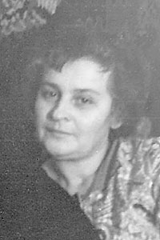

----
:Дата рождения: 20 сентября 1919 г.
:Место рождения: Беларусь, Брестская обл., Пружанский р-н, д. Ляхи
:Дата смерти: 24 мая 2009 г.
:Место смерти: Эстония, г. Таллин
:Место захоронения: Эстония, г. Таллин
:Родители: Яков Григорьевич Сургучёв (?-?),\
           Дарья Максимовна Сургучёва (Крупская) (1886-1973)
:Братья и сестры: неизвестно
:Супруг(а): [Василий Иванович Батищев (1915-1967)](/Батищевы/Василий_Иванович/index.md)
:Дети: [Галина Васильевна Бутт (Батищева) (1940)](/Батищевы/Галина_Васильевна/index.md),\
       [Екатерина Васильевна Хребтова (Батищева) (1945)](/Батищевы/Екатерина_Васильевна/index.md),\
       [Надежда Васильевна Ясинчук (Батищева) (1946)](/Батищевы/Надежда_Васильевна/index.md)
:Генеалогическое древо: [Батищевы](/Батищевы/index.md),\
                        [Сургучёвы](/Сургучёвы/index.md)
----
::: {subfigure}
:layout-sm: A|B
:layout-lg: AB
:layout-xl: AB
:layout-xxl: AB
:align: center
:gap: 4px
:subcaptions: above
:class-grid: outline

Антонина Яковлевна Батищева (Сургучёва)
:::