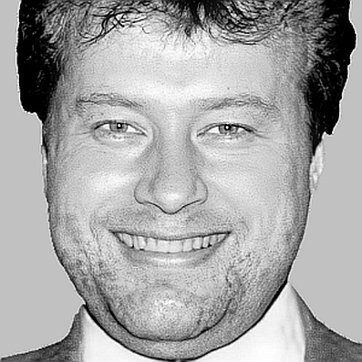

Здравствуйте!

{width=150px fig-cap="Владислав Веденеев" fig-align=center .column-margin .lightbox .margin-image}

Меня зовут Владислав Веденеев

Причудливо складывается жизнь человека – мозаика фактов и событий, дни, как картинки
в детском калейдоскопе. Каждый сам по себе и часть семьи и рода. Роды переплетаются между собой, 
формируя историю… 

Неожиданно осознал, что история рода просто исчезнет, если не зарисовать причудливую 
картинку, не сохранить для детей и внуков хотя бы те крупицы, которые ещё возможно собрать.

Не жаль времени, потраченного на поиски, не жаль поделиться…

Прошу только, не тащите информацию с сайта, а ссылайтесь на неё: информация постоянно 
обновляется, статьи могут меняться с появлением новых 
фактов. Не плодите дезинформацию в сети, пожалуйста!

Если Вы нашли себя в списке фамилий или можете помочь информацией об этих людях, прошу присылать 
письма по адресу ниже на gmail.com. Извините, придётся набрать руками, боты не дремлют! 

{fig-align=center}

Спасибо!

::: {.callout-warning}
Проект в активной переработке после буйства мамкиных хакеров…
:::
