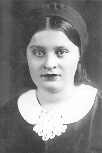

----
[Дата рождения:]{.smallcaps} 20 сентября 1919 г.
[Место рождения:]{.smallcaps} Беларусь, Брестская обл., Пружанский р-н, д. Ляхи
[Дата смерти:]{.smallcaps} 24 мая 2009 г.
[Место смерти:]{.smallcaps} Эстония, г. Таллин
[Место захоронения:]{.smallcaps} Эстония, г. Таллин
[Родители:]{.smallcaps} Яков Григорьевич Сургучёв (?-?), Дарья Максимовна Сургучёва (Крупская) (1886-1973)
[Братья и сестры:]{.smallcaps} неизвестно
[Супруг(а):]{.smallcaps} [Василий Иванович Батищев (1915-1967)](/Батищевы/Василий_Иванович/index.qmd)
[Дети:]{.smallcaps} [Галина Васильевна Бутт (Батищева) (1940)](/Батищевы/Галина_Васильевна/index.qmd), [Екатерина Васильевна Хребтова (Батищева) (1945)](/Батищевы/Екатерина_Васильевна/index.qmd), [Надежда Васильевна Ясинчук (Батищева) (1946)](/Батищевы/Надежда_Васильевна/index.qmd)
[Генеалогическое древо:]{.smallcaps} [Батищевы](/Батищевы/index.qmd), [Сургучёвы](/Сургучёвы/index.qmd)
----

{.lightbox} {.lightbox}
