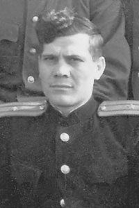
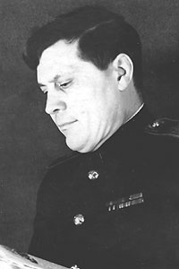
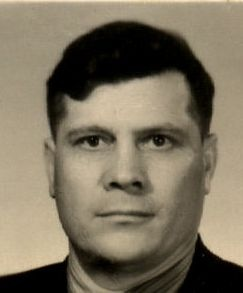
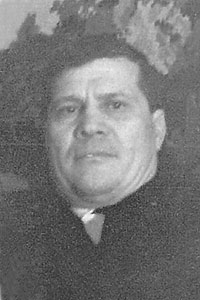

----
:Дата рождения: 15 января 1915 г.
:Место рождения: Россия, Саратовская обл., Пугачевский р-н, с. Красная речка
:Дата смерти: 01 марта 1967 г.
:Место смерти: Эстония, г. Таллин
:Место захоронения: Эстония, г. Таллин
:Родители: неизвестно
:Братья и сестры: неизвестно
:Супруг(а): [Aнтонина Яковлевна Батищева (Сургучёва) (1919-2009)](/Батищевы/Антонина_Яковлевна/index.md)
:Дети: [Галина Васильевна Бутт (Батищева) (1940)](/Батищевы/Галина_Васильевна/index.md),\
       [Екатерина Васильевна Хребтова (Батищева) (1945)](/Батищевы/Екатерина_Васильевна/index.md),\
       [Надежда Васильевна Ясинчук (Батищева) (1946)](/Батищевы/Надежда_Васильевна/index.md)
:Генеалогическое древо: [Батищевы](/Батищевы/index.md)
----
   

----
<!-- :Награды:
:::::{grid} 1 1 2 3
::::{card}
Медаль\
«За победу над Японией» \
?
^^^
:::{image} /_static/images/awards/Medal_Za_pobedu_nad_YAponiej.png
:alt: Медаль «За победу над Японией»
:align: center
:class: .bg-secondary-subtle .rounded-4
:height: 157px
:::
Архив
: ЦВМА,\
 Картотека награждений,\
 шкаф 8, ящик 10
: ЦВМА,\
 Фонд:1399,\
 Опись:13905,\
 Дело:16
+++
[Память народа](https://pamyat-naroda.ru/heroes/podvig-chelovek_nagrazhdenie1537378578/)
::::
::::{card}
Орден\
«Красная Звезда»,\
07.10.1945 г.
^^^
:::{image} /_static/images/awards/Orden_Krasnoj_Zvezdy.png
:alt: Орден «Красная Звезда»
:align: center
:class: .bg-secondary-subtle .rounded-4
:height: 157px
:::
Архив
: ЦВМА,\
 Картотека награждений,\
 шкаф 8, ящик 10

Наградил
: СТОФ, номер документа: 18/н
+++
[Память народа](https://pamyat-naroda.ru/heroes/podvig-nagrada_kartoteka1005437531/)
::::
::::{card}
Медаль\
«За боевые заслуги»,\
06.11.1946 г.
^^^
:::{image} /_static/images/awards/Medal_Za_Boevye_zaslugi.png
:alt: Медаль «За боевые заслуги»
:align: center
:class: .bg-secondary-subtle .rounded-4
:height: 157px
:::
Архив
: ЦВМА,\
 Картотека награждений,\
  шкаф 8, ящик 10

Наградил
: Президиум ВС СССР
::::
::::{card}
Орден\
«Красная Звезда»,\
05.11.1954 г.
^^^
:::{image} /_static/images/awards/Orden_Krasnoj_Zvezdy.png
:alt: Орден «Красная Звезда»
:align: center
:class: .bg-secondary-subtle .rounded-4
:height: 157px
:::
Архив
: ЦВМА,\
 Картотека награждений,\
 шкаф 8, ящик 10

Наградил
: Президиум ВС СССР
+++
[Память народа](https://pamyat-naroda.ru/heroes/podvig-nagrada_kartoteka1005437533/)
::::
::::: -->