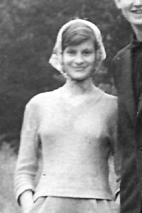
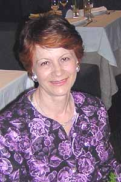

---
title: Екатерина Васильевна Хребтова (Батищева)
---
----
[Дата рождения:]{.smallcaps} 10 апреля 1945 г.
[Место рождения:]{.smallcaps} СССР, г. Владивосток
[Родители:]{.smallcaps} [Василий Иванович Батищев (1915-1967)](/Батищевы/Василий_Иванович/index.qmd), [Aнтонина Яковлевна Батищева (Сургучёва) (1919-2009)](/Батищевы/Антонина_Яковлевна/index.qmd)
[Братья и сестры:]{.smallcaps} [Галина Васильевна Бутт (Батищева) (1940)](/Батищевы/Галина_Васильевна/index.md),       [Надежда Васильевна Ясинчук (Батищева) (1946)](/Батищевы/Надежда_Васильевна/index.qmd)
[Супруг(а):]{.smallcaps} [Владимир Анатольевич Хребтов (1946)](/Хребтовы/Владимир_Анатольевич/index.qmd)
[Дети:]{.smallcaps}  [Агния Владимировна Лясковская (Хребтова) (1971)](/Хребтовы/Агния_Владимировна/index.qmd), [Наталья Владимировна Хребтова (1974)](/Хребтовы/Наталья_Владимировна/index.qmd)
[Генеалогическое древо:]{.smallcaps} [Батищевы](/Батищевы/index.qmd), [Хребтовы](/Хребтовы/index.qmd)
----

{.lightbox} {.lightbox} {.lightbox}

