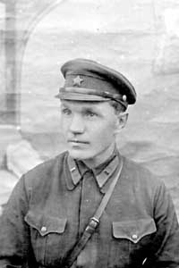
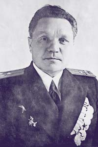

----

Дата рождения:
: 12.01.1898 (31.12.1897 по старому стилю)

Место рождения:
: Российская Империя, Московская губ., Серпуховский р-н, д. Калиново

Дата смерти:
: 11.04.1977

Место смерти:
: СССР, г. Москва

Место погребения:
: г. Москва, Ваганьковское кладбище, уч. 24

Родители:
: [Василий Афанасьевич Веденеев (?-?)](/Веденеевы/Василий_Афанасьевич)
: [Анисия Павловна Веденеева (Горячева) (?-?)](/Веденеевы/Анисия_Павловна)

Братья и сестры:
: [Анна Васильевна Веденеева (?-?)](/Веденеевы/Анна_Васильеввна) 

Супруг(а):
: [Валентина Спиридоновна (Николаевна) Веденеева (Руденко) (1903-1980)](/Веденеевы/Валентина_Спиридоновна)

Дети:
: [Элеонора Васильевна Саякина (Веденеева) (1945-2000)](/Веденеевы/Элеонора_Васильевна)

Генеалогическое древо:
: [Веденеевы](/Веденеевы/)

----

----

## Cлужба в ВМФ и РККА (до 1944 года)

| Начало | Окончание | Должность | Часть, соединение |
| -----: | --------: | :-------- | :---------------- |
| 30.06.1918 | 02.1919 | Красноармеец, младший командир | 2-й легкий артиллерийский дивизион, Северо-Двинский фронт |
| 02.1919 | 10.1919 | Курсант | Артиллерийские курсы при 6-й Армии, г. Вологда |
| 10.1919 | 02.1920 | Наблюдатель, Начальник связи | 2-й легкий артиллерийский дивизион, Северо-Двинский фронт |
| 02.1920 | 10.1920 | Слушатель | Высшая АвтоБронеШкола (АБШ), г. Москва |
| 10.1920 | 09.1921 | Начальник артиллерии, Исполняющий дела командира бронепоезда | Бронепоезд №108 «Вперёд к социализму» |
| 09.1921 | 09.1922 | Временно исполняющий дела командира бронепоезда | Бронепоезд №98 «Советская Россия» |
| 09.1922 | 08.1923 | Слушатель | Высшая военно-педагогическая школа, г. Петроград |
| 08.1923 | 09.1928 | Политрук, преподаватель обществоведения | Кавалеристские курсы усовершенствования командного состава (ККУКС), г. Новочеркасск |
| 09.1928 | 08.1929 | Слушатель | Высшая военно-педагогическая школа, г. Ленинград |
| 08.1929 | 12.1931 | Преподаватель СЭЦ | Кавалеристские курсы усовершенствования командного состава (ККУКС), г. Новочеркасск |
| 12.1931 | 10.1932 | Инструктор политотдела | 9-я стрелковая Донская дивизия, г. Ростов-на-Дону |
| 10.1932 | 12.1939 | Инструктор политотдела, военком эскадрильи | Военное Морское Авиационное Училище (ВМАУ) им. Сталина, г. Ейск |
| 12.1939 | 08.1943 | Военком ОМТО (отдел материально-технического обеспечения) | ВМУ БО (Военно-морское училище береговой обороны) им. ЛКСМУ, г. Севастополь, ст. Танхой |
| 08.1943 | 12.1943 | Заместитель командира по политчасти | Береговая база БТХ (?) ТОФ (Тихоокеанского флота) |
| 12.1943 | 07.1944 | Инспектор/инструктор | Политуправление ТОФ |
| 07.1944 |   | Заместитель начальника политотдела БО ГБ ТОФ | Политотдел Береговой обороны Главной базы ТОФ |
| 
