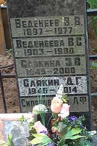

----

::: {.callout-warning title="Элеонора Васильевна Веденеева"}
Проект в активной переработке. Страница не готова
:::
Дата рождения:
: 29.03.1945

Место рождения:
: СССР, г. Владивосток, остров Русский

Дата смерти:
: 12.07.2000

Место смерти:
: Россия, г. Москва

Место погребения:
: Россия, г. Москва, Ваганьковское кладбище, уч. 24

Родители:
: [Василий Васильевич Веденеев (1897-1977)](/Веденеевы/Василий_Васильевич)
: [Валентина Спиридоновна (Николаевна) Веденеева (Руденко) (1903-1980)](/Веденеевы/Валентина_Спиридоновна)

Братья и сестры: 
: нет

Супруг(а): 
: [Дмитрий Григорьевич Саякин (1946-2014)](/Саякины/Дмитрий_Григорьевич)

Дети:
: [Дмитрий Дмитриевич Саякин (1967)](/Саякины/Дмитрий_Дмитриевич) <!-- 21 -->
: [Владислав Дмитриевич Веденеев (Саякин) (1973)](Веденеевы/Владислав_Дмитриевич) <!-- 22 -->

Генеалогическое древо:
: [Веденеевы](/Веденеевы/)
: [Саякины](/Саякины/)

----

")
