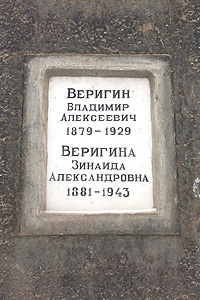

----

Дата рождения:
: 19.10.1879 (07.10.1879)

Место рождения:
: Российская империя, Московская губ., Звенигородский уезд, с. Одинцово

Дата смерти:
: 23.01.1929

Место смерти:
: Советский Союз, г. Москва

Место погребения:
: Советский Союз, г. Москва, Донское кладбище, кол. 12, секц. 21, ряд 3

Родители:
: [Алексей Иванович Веригин (1848-1915)](/Веригины/Алексей_Иванович)
: [Юлия Сергеевна Веригина (Николаева) (1861-1892)](/Веригины/Юлия_Сергеевна)

Братья и сестры:
: [Надежда Алексеевна Веригина (Филипович) (1878-1932)](/Веригины/Надежда_Алексеевна)
: [Юлия Алексеевна Веригина (1880-1937)](/Веригины/Юлия_Алексеевна)
: [Мария Алексеевна Переслегина (Веригина) (1881-1961)](/Веригины/Мария_Алексеевна)
: [Сергей Алексеевич Веригин (1887-?)](/Веригины/Сергей_Алексеевич)
: [Василий Алексеевич Веригин (1889-1973)](/Веригины/Василий_Алексеевич)
: Николай Алексеевич Веригин (3.08.1890-2.10.1890)
: [Софья Алексеевна Левыкина (Веригина) (1891-1970)](/Веригины/Софья_Алексеевна)
: [Александр Алексеевич Нестерович (1899-1958)](/Нестерович/Александр Алексеевич)
: Татьяна Алексеевна Гаусман (Нестерович) (?-?)
: [Владимир Алексеевич Нестерович (?-?)](/Веригины/Владимир_Алексеевич)

Супруг(а):
: [Зинаида Александровна Веригина (Яфа) (1881-1943)](/Веригины/Зинаида_Александровна)

Дети:
: [Галина Владимировна Веригина (1908-1921)](/Веригины/Галина_Владимировна)
: [Кира Владимировна Веригина (1909-1992)](/Веригины/Кира_Владимировна)

Генеалогическое древо:
: [Веригины](/Веригины)

----

----

## Краткое жизнеописание

*(Версия статьи: 1.0 от 26-06-2017)*

Титулярный советник Владимир Алексеевич Веригин родился 7 октября 1879 года по старому стилю в семье инженера путей сообщения, коллежского асессора Алексея Ивановича и Юлии Сергеевны Веригиных в селе Одинцово Звенигородского уезда  Московской губернии.

Владел французским и немецким языками.

В 1907 году окончил юридический факультет Московского Университета, о чем свидетельствует диплом первой степени №24678 от 10 сентября 1908 года.

Будучи студентом, с 1905 по 1907 годы работал конторщиком в отделе инкассо Московского Купеческого банка.

Женился в промежутке между 1905-1907 годами на дочери статского советника Зинаиде Александровне Яфа, которая подарила ему в 1908 и 1909 годах двух дочерей.

Имя старшей дочери неизвестно, т.к. она скончалась в 1919 году в возрасте 11 лет и имя ее не упоминается. Однако я не оставляю надежд узнать его [*ред.*— В формуляре выше приведено имя старшей дочери и изменён год смерти]{.column-margin}.

Имя же младшей дочери хорошо известно – Кира. Жизненный путь маленькой Киры легко прослеживается, т.к. она стала в дальнейшем видным ученым кандидатом геолого-минералогических наук Кирой Владимировной Веригиной и всю жизнь проработала в Почвенном институте АН СССР им. В.В.Докучаева.

После окончания университета, видимо по настоянию отца Алексея Ивановича Веригина, который хотел видеть его при железных дорогах, с 1907 по 1908 годы Владимир Алексеевич работает контролером службы сборов Северной железной дороги.

Однако, тяга к банковскому делу берет вверх и он возвращается на эту стезю, и с 1910 по 1911 годы работает в Русском для внешней торговли банке. Причем здесь впервые он становится членом правления. А в 1912 году Владимир Алексеевич в Московском Купеческом обществе взаимного кредита становится не только членом правления, но и секретарём правления.

В 1912-1913 годах Владимир Алексеевич отбывает в Рязань. Здесь он работает в Рязанском отделении Крестьянского поземельного банка. А с 1914 годя является «непременным членом» этого банка, т.е, по нынешним временам, в моём понимании, член совета директоров.

Между Февральской и Великой Октябрьской революциями банк становится отделом Государственного Земельного банка. Однако и в этот период Владимир Алексеевич продолжает работать в нём. А затем банк и вовсе ликвидирован декретом Совета народных комиссаров РСФСР в конце 1917 года. Поэтому в период с 1918 по 1919 годы он является ликвидатором банка.

После ликвидации банка Владимир Алексеевич активно помогает молодой Советской власти, не вырастившей еще собственных юристов и финансистов, строить основу материально-технического обеспечения сельского хозяйства. В период с 1919 по 1920 годы он работает в Рязанском Губземотделе, непосредственно, в оргасеве и миллиардном комитете.

А чем вообще занимались оргасевы? Для этого надо обратится к ежедневной газете органа Томского Губисполкома и Томского Губкома РКП(б) «Знамя Революции» № 255 от 23 ноября 1920 г., а там товарищ Чукаев, хотя и по Томской, но в принципе сие не имеет особого значения, четко «указал, что на оргасевы возложены следующие задачи: 1) организация и увеличение посевной площади, 2) распределение семян среди населения, 3) распределение сельскохозяйственных машин и с.х. инвентаря, 4) ремонт  с.х. машин и с.х. инвентаря и 5) учет и контроль крестьянских мельниц».

Миллиардный же комитет занимался рассмотрением заявлений крестьянских коллективов об отпуске денежных средств, да и вообще государственным финансированием и кредитованием сельского хозяйства.

К 1919 году, а может и ранее, иных документальных подтверждений нет, Владимир Алексеевич Веригин является секретарем Рязанских губернских оргасева и миллиардного комитета. Судя по советской иерархии чиновников, секретарь это высшее управляющее звено советской ячейки власти. Таким образом, он возглавлял две ключевые организации Рязанского Губземотдела, развивающих сельское хозяйство. В этот же период там же он является управляющим делами Управления по топливу и лесозаготовительного отдела. Что, кому и как в то время подчинялось, как мне кажется, выяснять нет необходимости, но самое главное, что Владимир Алексеевич занимал в Рязгубземотделе ключевые должности в этот период.

В 1918 и 1919 годах Владимиру Алексеевичу пришлось претерпеть несправедливость репрессий. В 1918 году он по постановлению Рязанского Губчека без предъявления обвинения провел две недели в лагере принудительных работ в качестве заложника. Освобожден по постановлению того же Рязгубчека.

В 1919 же году он уже провел в стенах Рязанского губернского лагеря принудительных работ, также в качестве заложника, с 4-го сентября по 20 ноября. И тут сложилась казусная ситуация. Посадить посадили, а подумать, кто руководить будет, не успели. Поэтому, судя по пропускам, его регулярно 2-3 раза в неделю, выпускали для работы в данных организациях. А с 24 октября 1919 года, вообще, выписали постоянный пропуск, следующего содержания: «выдано настоящее удостоверение заключенному лагеря принудительных работ Владимиру Алексеевичу Веригину в том, что ему с сего числа ежедневно впредь до распоряжения разрешается отлучаться из лагеря без конвоя на занятия в Губземотделе до 6 часов вечера, к каковому времени означенный Веригин должен являться в лагерь без опоздания – что подписью и приложением печати удостоверяется».

Затем следует интересный период, который мне сегодня сложно оценить с исторической точки зрения, повышение это было или ссылка. В 1920 году Владимир Алексеевич отправляется на Северный Кавказ в город Владикавказ, столицу современной Северной Осетии. Там он становится Начальником продовольственно-фуражного отдела Кавказского Лесного Комитета. В аккурат согласно дате, видимо, помогал комбедам (комитетам бедноты) с декретом от 11 июня 1918 года наперевес воплощать политику деревенской «Диктатуры пролетариата» и скрупулёзно учитывал изъятое добро, незаконно потным кулацким горбом нажитое.

Нахлебавшись «Красного террора», чуждого тонкой дворянской душевной организации, он покидает пост начальника в 1920-1921 году и становится простым старшим бухгалтером. Для чего переехал в Нальчик, по тем временам слободу с населением около 15000 человек, и устроился на деревообрабатывающий завод «Чинар», известного вплоть до середины 90-х, правда, после всех слияний, под названием АООТ «Эльбрус».

На заводе «Чинар» он активно трудился, видимо, вплоть до получения Нальчиком статуса города. И в том же 1921 году, надышавшись свежим горным воздухом и поправив здоровье, Владимир Алексеевич возвращается в Москву.

Здесь он с 1921 по 1922 годы становится ревизором по заготовкам ржи в Торгово-промышленном товариществе «И.М. Каменев и К°». В 1922 году начинает заниматься и общественным трудом. Для чего становится членом Жилтоварищества, в бывшем доме, принадлежавшему до революции его тестю Александру Фёдоровичу Яфе по адресу: Староконюшенный пер., д. 30, куда, кстати, в квартиру №3 и вернулся после 10-ти летнего отсутствия.

С 20.VI.1923 по 10.XII.1928 года Владимир Алексеевич является сотрудником Внешторгбанка.

В этот период он занимал должности от счетовода до помощника старшего бухгалтера, а 1-го октября 1927 года был назначен архивариусом. А по тем временам архив банковских операций это вам не компьютер с базой данных. Папки, полки, шкафы, а также архивная пыль для аллергического насморка в награду. И, видимо, что-то и как-то не так совсем было, как виделось прогрессивному мыслительному процессу Владимира Алексеевича. Да и с учетом того, что его дражайшая супруга Зинаида Александровна Веригина (Яфа) служила после последней революции машинисткой-каталогизатором, то все существенные задержки и недостатки архивной системы банка были выявлены быстро.

Владимир Алексеевич пишет докладную с изложением необходимости преобразований, какие, как и что надо сделать, а также о новых методах хранения информации, в том числе и буржуйских странах. Это вам не флэшку на компьютере открыть. И, поскольку Россия страна традиций, инициатива здесь всегда наказуема исполнением.

Много сил, как обычно, потрачено на согласование, добывание оборудования и конечную организацию. Всю красоту обновления описывать не буду, а когда всё было готово и начало работать, то как в песне… «И вот когда от нетерпенья уже кружилась голова… Не то с небес, не то поближе, раздались горькие слова…»

Уволен с 10.XII.1928 на основании пункта «А»: «в случае полной или частичной ликвидации предприятия, учреждения или хозяйства, а равно в случае сокращения работ в них» статьи 47 КЗоТ РСФСР от 31 декабря 1922 г. В общем, сам вырыл яму, при падении в которую, соломки не оказалось…

Владимир Алексеевич, как юрист, подал апелляцию, с прошением признать реорганизацию рационализаторским предложением. Таким образом, предложил переквалифицировать изначальную статью увольнения на иную, а также, на основании изменения статьи, выплатить ему 1 ½ оклада в качестве пособия по сокращению. Однако дополнительных бумаг на сию тему в деле нет. Моё предположение, что всё осталось, как было указано в официальных бумагах.

9 января 1929 года, о чем свидетельствует его резолюция, некие именно документы, видимо, трудовую книжку, он получил.

Не перенеся потрясений, Владимир Алексеевич Веригин на 49 году жизни 23 января 1929 года скоропостижно скончался…
