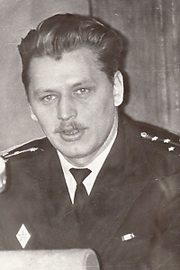
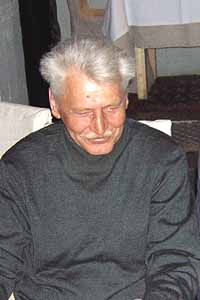

----

Дата рождения:
: 26.07.1946

Место рождения:
: CCCР, г. Москва

Дата смерти:
: 05.12.2014

Место смерти:
: Россия, г. Москва

Место погребения:
: Россия, г. Москва, Ваганьковское кладбище, уч. 24

Родители:
: [Григорий Иванович Саякин (1910-1979)](/Саякины/Григорий_Иванович)
: [Людмила Александровна Саякина (Нестерович) (1920-2001)](/Саякины/Людмила_Александровна) <!-- 14 -->

Братья и сестры: 
: [Владимир Григорьевич Савин (Саякин) (1944)](/Савины/Владимир_Григорьевич)

Супруга: 
: [Элеонора Васильевна Саякина (Веденеева) (1945-2000)](/Саякины/Элеонора_Васильевна)

Дети:
: [Дмитрий Дмитриевич Саякин (1967)](/Саякины/Дмитрий_Дмитриевич) <!-- 21 -->
: [Владислав Дмитриевич Веденеев (Саякин) (1973)](Веденеевы/Владислав_Дмитриевич) <!-- 22 -->

Генеалогическое древо:
: [Саякины](/Саякины/)

----

