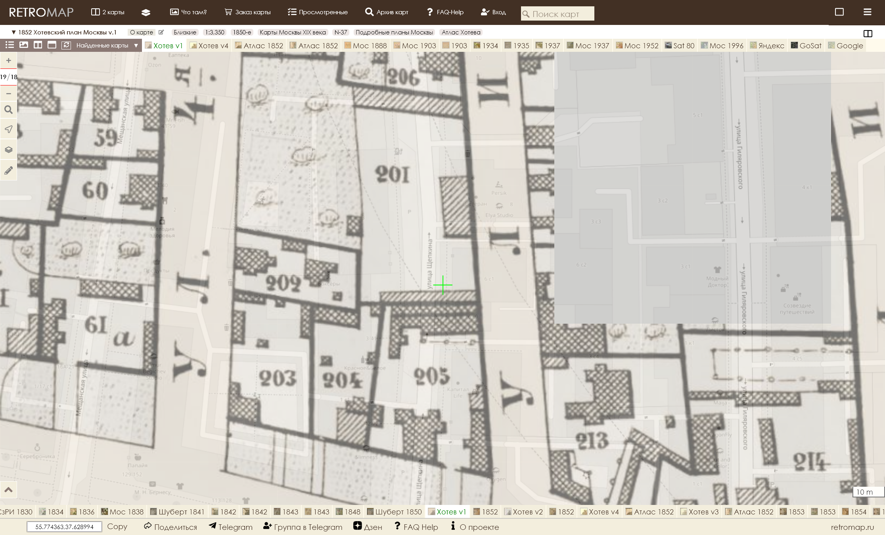
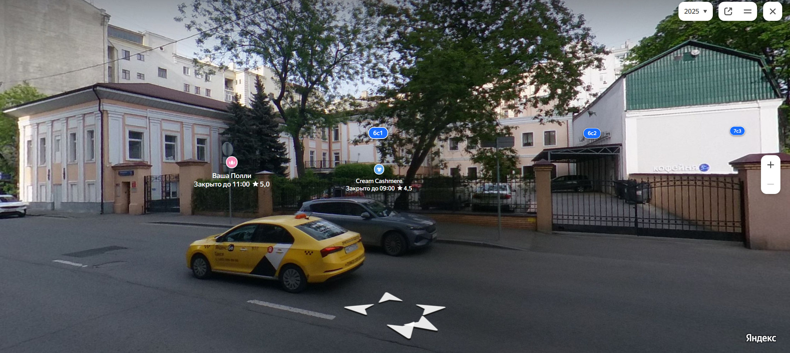
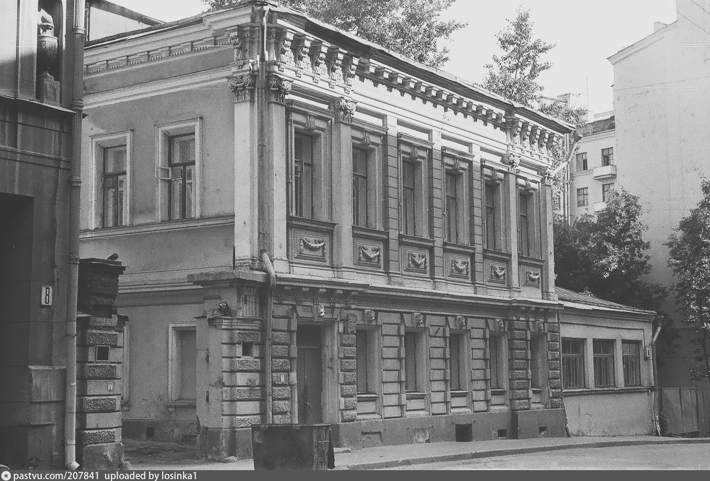

Сложная задача выросла на горизонте: поспорить с общественным мнением, тем более, если его разделяет именитый историк и москвовед Сергей Константинович Романюк, написавший за свою жизнь 11 книг и около 200 статей, согласно Википедии [1]. Авторитет неоспорим и тяжело браться за перо, однако, истина или хотя бы возможность установить историческую справедливость дороже.

Речь пойдет о доме №6 по улице Щепкина в г. Москве, который Сергей Константинович Романюк в статье «Мещанская слобода», опубликованной в №8 журнала «Наука и жизнь» за 1999 г., считает особняком купца 2-й гильдии Ивана Григорьевича Урина, торговца сахаром и чаем. Это утверждение, а также то, что сие творение принадлежит кисти и мастерку Виктора Ивановича Веригина, будет поставлено мной под сомнение.

Всё началось с того, что, исследуя семью титулярного советника, инженера путей сообщения, члена ИРТО, владельца кирпичного завода в Одинцово Алексея Ивановича Веригина, я натыкался на родственные отношения Алексея Ивановича и Виктора Ивановича Веригиных. Тоже думал, что братья, но доказать это я пока не смог. То, что были свояками это точно: их дочери вышли замуж за родных братьев Николая и Павла Алексеевичей Филипповичей. Немного поработав, я нашел точную дату смерти архитектора, действительного статского советника Виктора Ивановича Веригина, которую зафиксировал в Википедии [1], а также некролог, автограф и пополнил список его архитектурных работ. Я уверен это ещё не всё, вопрос только времени.

Естественно, работы, что удавалось найти, я скрупулёзно пытался разыскать на карте Москвы. И вот что в конечном итоге вышло. В «Неделе строителя» – еженедельном приложении к журналу «Зодчий» – в разделе «частные постройки, о разрешении коих заявлены ходатайства в городские управы», №24 за 1882 год, страница 190, конкретно для Москвы, значится следующее: №№ по порядку с 1-го января – 630; название улиц и номера дворов – 3-я Мещанская ул., 221; владельцы – Урин И.Г.; зодчие и техники – Веригин, род строения – смешанный 2-х этажный дом [2]. И в том же издании №17, 1883 г., стр. 127: 275; 3-я Мещанская ул., 221; Урин И.Г.; Стратилатов А.Н.; каменное одноэтажное, частию жилое и металлическая терраса [2]. Это отправные точки.

Перед тем, как продолжать далее, давайте вспомним переименования улиц. Итак: ул. 1-я Мещанская в Проспект Мира; ул. 2-я Мещанская в ул. Гиляровского; ул. 3-я Мещанская в ул. Щепкина; ул. 4-я Мещанская в Мещанскую. Они потребуются для ориентации на карте.

Я открыл план А. Хотева [3] за 1852 год на сайте проекта Сергея Тарасова «RetroMap» [4]. Нашел участок 221, подкрашен красным. На карте, судя по штриховке, построены два каменных строения. По алфавитному указателю к плану [5] участок принадлежит капитанше Любови Александровне Сокиной.

Согласно адрес-календарям и табелям домов Москвы, в 1869 году принадлежал Аполинарии Павловне Поповой, супруге генерал-лейтенанта (как указано в справочнике или, скорее всего, вдове на тот момент). А в 1893 году в этих домах уже размещается приют для слепых детей.

При земельной ревизии была введена новая нумерация участков. Т.е. земельному участку присвоили новый номер, а через дробь, на всякий случай, писали старый. И после неё участок имеет уже номер 241/221.

Обратился я к панорамам Яндекса [6]  и, о чудо чудное, строения живы и по сей день. Только появился трехэтажный флигель в правой верхней части. Видимо, приют рос и опять стал мал. В 1911-1912 годах для него архитектором Г. Гельрихом было построено новое здание со встроенной церковью равноапостольной Марии Магдалины, которое и по сей день без купола церкви находится по адресу: Проспект Мира, дом 13, строение 1.

Ко всему вышесказанному остается только добавить, что участок 241/221 еще и находился на 2-й Мещанской улице, а не на 3-ей. Таким образом, участок 241/221 исключается из возможных участков, где мог быть дом купца И.Г. Урина.

И тут я опять вспомнил, про земельную ревизию. Мне показалось естественным, что в «Неделе строителя» написан уже новый номер. Обратившись к «Плану частей города Москвы» за 1903 год [7] на «RetroMap»[4], я выяснил, что новый номер 221 получил участок 201, т.е. 221/201, выделен зелёным цветом. Участком до 1909 владели братья Козьма и Павел Осиповичи Тимофеевские, потомственные почётные граждане. Значит, скорее всего, И.Г. Урин выстроил дом на арендованных землях.

 Участок 221/201 имеет границы по улицам 3-й и 4-й Мещанским и сохраняет их с 1852 по 1903 годы, а как выяснилось и позднее. Слева карта 1937 г. [8]: очертания участка легко угадываются, хотя немного искажены пропорции, что можно списать на изменение точности картографии. В 1852 году, я думаю, оно было, скорее, изобразительным, а в 1937 уже начертательным.

Эта карта еще примечательна тем, что при её составлении были учтены этажность, тип и назначение построек.

Надписи на постройках понимаю следующим образом:

Без надписи  
Строение одноэтажное, некаменное, нежилое

Ж
Строение одноэтажное, некаменное, жилое

К
Строение одноэтажное, каменное, нежилое

КЖ
Строение одноэтажное, каменное, жилое

2Ж
Строение двухэтажное, некаменное, жилое

2К
Строение двухэтажное, каменное, нежилое

2С
Строение двухэтажное, смешанное, т.е. каменный первый

этаж и второй (или остальные) некаменные, нежилое

2КЖ
Строение двухэтажное, каменное, жилое

2СЖ
Строение двухэтажное, смешанное, жилое

Во всех остальных случаях меняется только цифра этажности.

Нужно ещё коснуться термина «терраса». Согласно Википедии [1]: «терраса» – (фр. terrasse — площадка) — открытый настил на подготовленном основании (как правило, опорах). Терраса может быть отдельно стоящим строением, а частным случаем террасы является беседка.

Исходя из данной таблицы, определения «терраса» и отправных точек исследования, перечисленных выше, мы будем искать на плане участка, имевшего номер 221/201, три строения: без надписи, КЖ, 2СЖ. Все эти три здания присутствуют на плане участка и отмечены красным цветом. Однако, сам особняк отмечен не 2СЖ, а 2КЖ. Это я могу объяснить только тем, что в процессе строительства И.Г. Урин мог изменить проект, просто из прихоти или с расчетом на достройку этажей в дальнейшем. Также, дом за полвека мог просто перестраиваться текущим владельцем или восстанавливался после разрушения, например, пожара.

Остается только добавить, что особняк купца 2-й гильдии Ивана Григорьевича Урина, судя по карте 1952 г. [9] просуществовал до 1952 года. И был снесен в промежутке с 1953 по 1954 годы при строительстве дома 1 строение 1 на Малой Сухаревской площади, чей год постройки датируется 1955 годом.

На карте голубым цветом обозначен и особняк с современным адресом: г. Москва, ул. Щепкина, дом 6, строение 1 и 6. Он бозначен как 3КЖ и КЖ.

И совершенно справедливо. Если посмотреть на современный вид здания, то хорошо видно, что сейчас цоколь облицован плиткой. Однако, если обратиться к фотографии И. Нагайцева «ул. Щепкина, дом №6» 1987 г. [10], то обнаружится, что за 40 лет полуэтаж укатали асфальтом на 30 см. Можно предположить, что отроется и ещё 60 см с окнами с начала века. И, соответственно, современный цоколь преврашается в полуэтаж. В архитектурном словаре В.И. Плужникова указано: «полуэтаж – этаж значительно меньшей высоты по сравнению с другими этажами того же здания» [11]. А исходя из этого, советские картографы в 1937 г. его верно определили – 3КЖ,  одноэтажная же пристройка, в которой, видимо, в начале века шла бойкая торговая жизнь, просто КЖ.

Помимо всего, сравнивая две карты [7][8] на сайте проекта Сергея Тарасова «RetroMap» [4], становится очевидным, что дом №6 по ул. Щепкина построен на участке 231/211. С 1852 [5] по 1882 г.  [12] год этот участок принадлежал мещанину Ивану Васильевичу Козлову и/или наследникам.

_На основании приведенных материалов я считаю, что:_

Особняк купца 2-й гильдии Ивана Григорьевича Урина, построенный Виктором Ивановичем Веригиным находился на левой стороне улицы 3-ей Мещанской, ныне улице Щепкина, напротив подъезда №1 дома 1с1 на Малой Сухаревской площади.
Построен на землях, арендованных у братьев Тимофеевских, участок 221/201.
К 1900 году И.Г. Урин дом уже продал.
Дом просуществовал с 1882 г. по 1953-54 гг.
Дом 6 по улице Щепкина построен на участке 231/211, принадлежавшему мещанину Ивану Васильевичу Козлову, по данным справочно-информационного портала «MoscowMap.ru» в 1862 году.
Дом 6 по улице Щепкина не является творением архитектора Виктора Ивановича Веригина и не является, как принято считать: «Особняком купца Урина».

Использованные материалы и литература:

[1] [Свободная энциклопедия Википедия](https://ru.wikipedia.org/wiki/Заглавная_страница) (Wikipedia® — зарегистрированный товарный знак некоммерческой организации Wikimedia Foundation, Inc.);

[2] «Неделя строителя», прибавление к журналу «Зодчий», издаваемому санкт-петербургским обществом архитекторов, №24 за 1882 г., №17 за 1883 г., типография Эдуарда Гоппе, СПб;

[3] [«Атлас столичного города Москвы»](http://www.retromap.ru/m.php#r=081852&amp;z=19&amp;y=55.774363&amp;x=37.628994) / Сост. А. Хотевым. – 1:3350, 40 саженей в дюйме. М., 1852-1853 гг. (Типография Ведомостей Московской городской полиции) (Материалы проекта Сергея Тарасова «RetroMap»);

[4] [Проект Сергея Тарасова «RetroMap»](https://www.retromap.ru/)

[5] «Алфавитный указатель к плану столичного города Москвы» / Сост. А. Хотевым. – М., 1852-1853 гг. (Типография Ведомостей Московской городской полиции);

[6] [Поисковая система «Яндекс»](https://www.ya.ru/)

[7] [«Планы частей города Москвы с указанием крепостных номеров владений из приложения к Адрес-календарю города Москвы на 1904 г. «Вся Москва».](http://www.retromap.ru/m.php#r=071903&amp;z=17&amp;y=55.774516&amp;x=37.628638) Составлены при Архиве Строительного Отделения Московской Городской Управы на 1901 г. Издание Московской Городской Управы (Материалы проекта Сергея Тарасова «RetroMap»);

[8] [Подробный план Москвы. 1937 г.](http://www.retromap.ru/m.php#r=0619371&amp;z=19&amp;y=55.774124&amp;x=37.628917) Сборный план, составленный из подборки склеенных листов планов города Москвы. Исполнено Обл. Геодезической конторой. Ф-ка Картолитографии МООМП. Москва. Масштаб планов - 1:2000. Сечение рельефа через 1 м. Листы планов изданы в период от 1937 до 1949 года. (Материалы проекта Сергея Тарасова «RetroMap»);

[9] [План Москвы. 1952 г.](http://www.retromap.ru/m.php#r=051952&amp;z=17&amp;y=55.774204&amp;x=37.628774) План Москвы издания Мосгоргеотреста Архитектурно-планировочного Управления г. Москвы. Съемка 1951 г., издание 1952 г. Сборный план, составленный из 49 крупномасштабных фрагментов. Схема расположения фрагментов на общем плане и условные обозначения представлены на отдельных листах. (Материалы проекта Сергея Тарасова «RetroMap»);

[10] «PastVu - проект по сбору свидетельств прошлого. Взгляд на историю среды обитания человечества». [И. Нагайцев «Ул. Щепкина, дом №6», 1987 г.](https://pastvu.com/p/207841)

[11] Плужников В.И., «Термины российского архитектурного наследия», Издательство «Искусство» Москва, 1995 г.

[12] «Указатель улиц и домов столичного города Москвы, с пояснением сведений исторического происхождения наименования улиц, площадей и других мести с указанием к каким мировым и судебным участкам города причислены улицы с домами, на них находящимися, с историческим описанием всех церквей города и приложением плана города», М, Типография при канцелярии Главного московского обер-полицмейстера, 1882 г.