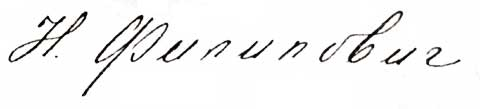

----

Дата рождения:
: 02.10.1878

Место рождения:
: Российская империя, Москва

Дата смерти:
: 1932

Место смерти:
: СССР, Москва

Место захоронения:
: Россия, г. Москва, Новое Донское кл., уч. 4, алл. 3

Родители:
: Алексей Иванович Веригин (1848-1915)
: Юлия Сергеевна Веригина (Николаева) (1861-1892)

Братья и сестры:
: Владимир Алексеевич Веригин (1879-1929)
: Юлия Алексеевна Веригина (1880-1937)
: Мария Алексеевна Переслегина (Веригина) (1881-1961)
: Сергей Алексеевич Веригин (1887-?)
: Василий Алексеевич Веригин (1889-1973)
: Николай Алексеевич Веригин (3.08.1890-2.10.1890)
: Софья Алексеевна Левыкина (Веригина) (1891-1970)
: Александр Алексеевич Нестерович (1899-1958)
: Татьяна Алексеевна Гаусман (Нестерович) (?-?)
: Владимир Алексеевич Нестерович (?-?)

Супруг(а):
: Николай Алексеевич Филипович (1872-1937)
  
Свидетельство о прекращении брака №1451 от 06 июля 1928 г., выдано: Хамовническим отделением Московского ГУБЗАГС

Дети:
: неизвестно

Генеалогическое древо:
: Веригины

----

## Образование:

Помимо домашнего образования, Надежда Алексеевна окончила в 1896 году 7 классов гимназии и потом 3 курса Московского городского народного университета имени А. Л. Шанявского (Шанявский университет) по естественным наукам. Владеет языками: немецким и французским (\"могла свободно говорить, читать и писать\")

Послужной список:

1910-XI.1918, Музыкально-драматическое училище филармонического общества, помощник инспектора;

II.1919- XII.1921, Подотдел экспедиции и регистратуры в главном Правлении спичечной промышленности, заведующая подотделом;

XII.1921- II.1922, отдел снабжения ГЛАВХИМ, делопроизводитель;

VIII.1922-VI.1925, Народный Комиссариат Просвещения (НКП), последовательно должности заведующих: столовой, прачечной, а также материального и продуктового склада в Институте Красной Профессуры.
XI.1925, поступила в Российская ассоциация научно-исследовательских институтов общественных наук (РАНИОН) на должность делопроизводителя.
c 1.Х.1926 по 1.Х.1930, РАНИОН, Кабинет Иностранных Языков, Кабинет Института Экономики, библиотека. С VII.1928 года лично просит освободить её от работы  в библиотеке Кабинета Иностранных Языков

с 12.Х.1931 зачислена в Институт Техники и Технической Политики Коммунистической академии.

## Семейное положение (размышления автора)

Достоверно известно, Надежда Алексеевна разведена с Николаем Алексеевичем Филиповичем, о чем гласит свидетельство о прекращении брака №1451 от 06 июля 1928 г., выдано: Хамовническим отделением Московского ГУБЗАГС, хранящееся в ГА РФ, ф.4655, оп. 2, д. 229. Там же указано, что Надежде Алексеевне возвращена фамилия: Веригина. Таким образом, ещё раз проговорю, что в архивах РАН нужно вести поиск Надежды Алексеевны Веригиной, если она немного погодя вновь не вышла замуж.

Далее я позволю себе немного пофантазировать.  Когда она вышла замуж за Николая Алексеевича Филиповича не ясно. Но… Из адрес-календаря «Вся Москва» за 1908 и 1910  года известно, что в эти годы Павел Алексеевич Филипович, брат Николая Алексеевича, жил в доме архитектора Виктора Ивановича Веригина в Спасском тупике. А в 1911 году уже в доме Алексея Ивановича Веригина в Большом Вражском переулке, где с этого же года числится проживающей в отеческом гнезде и сама Надежда Алексеевна.

Тайну родственных отношений Алексея Ивановича и Виктора Ивановича Веригиных пока удалось разгадать частично, но по положению дел явно близкие родственники. Так вот мысль, которая пришла мне в голову: если Павел Алексеевич Филипович не родственник Веригиным, то почему свободно живет у них, то в одном доме, то в другом. И стал я более внимательно просматривать адрес-календари «Вся Москва». И, о чудо, в 1913 году наткнулся на новый персонаж Екатерину Викторовну Филиппович, потомственную дворянку и проживающую по адресу: Спасский тупик, 6. Остальное как на ладони, Екатерина Викторовна, проживающая в доме действительного статского советника Виктора Ивановича Веригина, его дочь. А Павел Алексеевич Филипович ее муж. И выходит, если Алексей Иванович и Виктор Иванович Веригины не состоят в более тесном родстве, то по крайней мере они – сваты.

На Руси в старину было заведено, если барышня до 24 лет не вышла замуж, то она отправлялась в монастырь. Это я к тому, что Надежде Алексеевне в 1908 году уже 30 лет. И скорее всего, она вышла замуж ранее 1908 года. При этом она могла жить у мужа, поэтому она только в 1911 году появляется в доме отца. Это могла быть первая попытка расстаться с мужем Николаем Алексеевичем.

Далее Алексей Иванович Веригин в 1912 году, после смерти Виктора Ивановича Веригина, продает всё и отбывает, видимо, в г. Борисов Минской губернии. Надежда Алексеевна, выходит, была вынуждена вернуться к нелюбимому мужу и некоторое время в 1913 году жить с ним вместе под одной крышей съемной квартиры в доходном доме на Средней Пресне, 28. Но, в 1914 году Николай Алексеевич, опять пропадает из поля видимости, а появляется в 1915 году и по другому адресу: ул. Воздвиженка, 11. Где и проживал до 1917 года. А она проживает по-прежнему на Средней Пресне.

После Великой Октябрьской Революции, скорее всего, уже было не так актуально, а может и не безопасно, печататься дворянам в таких справочниках. Поэтому отследить все семейство после 1917 года пока не представляется мне возможным.

Резюме. Брак Николая Алексеевича Филиповича и Надежды Алексеевны Веригиной был заключен в период с 1900 до 1908 года. Оказался несчастливым и окончательно развалился в 1914 году. А окончательная точка была поставлена в 6 июля 1928 года.

Просматривая справочники с 1900 до 1917 года, никогда не видел никого с фамилией Филипович и отчеством Николаевич, таким образом, позволю себе предположить, что в браке с Николаем Алексеевичем у Надежда Алексеевны детей не было.

Однако, после 1917 года высоты общественной морали несколько понизились и она могла родить себе ребенка. Но вот вопрос, как записала и где искать. А вышла ли она еще раз замуж после 1928 года, пока данных нет…

Последний известный адрес проживания: г. Москва, ул. Остоженка, д. 53, комн. 28. Сегодня это, видимо, ул. Остоженка, д. 53А, т.к. на территории Лицея цесаревича Николая она врядли могла проживать, здание в котором расположен наркологический диспансер №14.

И в заключении статьи автограф Надежды Алексеевны Веригиной (Филипович) (от 29 июня 1925 года):

