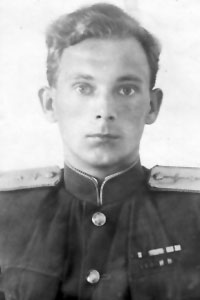
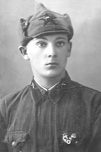

----

Дата рождения:
: 12.04.1921

Место рождения:
: СССР, Псковская обл., г. Псков

Дата смерти:
: 29 .05.1972

Место смерти:
: СССР, г. Москва

Место захоронения:
: СССР, Московской обл., г. Химки, Химкинское кладбище

Родители:
: неизвестно

Братья и сестры:
: Любовь Ивановна Хребтова
: Нина Ивановна Хребтова
: Лидия Ивановна Хребтова
: Юрий Иванович Хребтов

Супруга:
: Агния Ивановна Хребтова (Беляева) (1922-2017) (31)

Дети:
: Владимир Анатольевич Хребтов (1946)

Генеалогическое древо:
: Хребтовы

----

 

## НАГРАДЫ:

### "Медаль «За боевые заслуги», 14.05.1943 г

Приказ подразделения №: 15/н от: 14.05.1943, издан: ВС 8 ВА Южного фронта

::: {.column-margin}
{height=157px}
:::

Архив:
: ЦАМО, Фонд: 33, Опись: 686044, Ед.хранения: 633, № записи: 18392115

### Медаль «За оборону Сталинграда», 04.02.1944 г.

Приказ подразделения от: до 10.05.1943, издан: 32 РАБ

::: {.column-margin}
{height=157px}
:::

Архив: 
: ЦАМО, Фонд: 20628, Опись: 2, Ед.хранения: 48, № записи:  1560062615

### Орден «Красная Звезда», 01.07.1941-31.08.1941 г.

Приказ подразделения №: 68/н от 28.06.1945 издан: ВВС

::: {.column-margin}
{height=157px}
:::

Архив
: ЦАМО,&nbsp;Ф: 33,&nbsp;О: 686196, Ед.хранения: 523, № записи: 22667604

Выдержка из наградного листа ордена Красной Звезды:
: «В Отечественной войне участвовал в составе 32 РАБ 8 ВА и проявил себя волевым, инициативным, обладающим организаторскими способностями офицером. За время Отечественной войны вырос от старшего сержанта до техник-лейтенанта. В июле месяце 1941 г. руководил уничтожением и минированием аэродромов \"Бельцы\", Кишинёв, Бендеры. В августе 1941 г. под непрерывным огневым воздействием немцев с воздуха в течении 36 часов под руководством Хребтова был подготовлен для приёма авиации Николаевский аэродром. В период готовящегося наступления в Донбасе был начальником разведывательной группы по разведке и разминированию аэродромов, освобожденных от немцев. Участвовал в разминировании аэродромов: Серго, Алмазное, Славяносербск, Голубовское и др. На Сталинградском фронте руководил изысканием и строительством 18 оперативных аэродромов. За двадцать шесть месяцев участия в Отечественной войне участвовал в изыскании и обследовании до 100 аэродромов. Разминировал 16 аэродромов, сняв до 3500 мин.За период обучения в академии успеваемость отличная и хорошая, служит примером в дисциплине и исполнительности».
